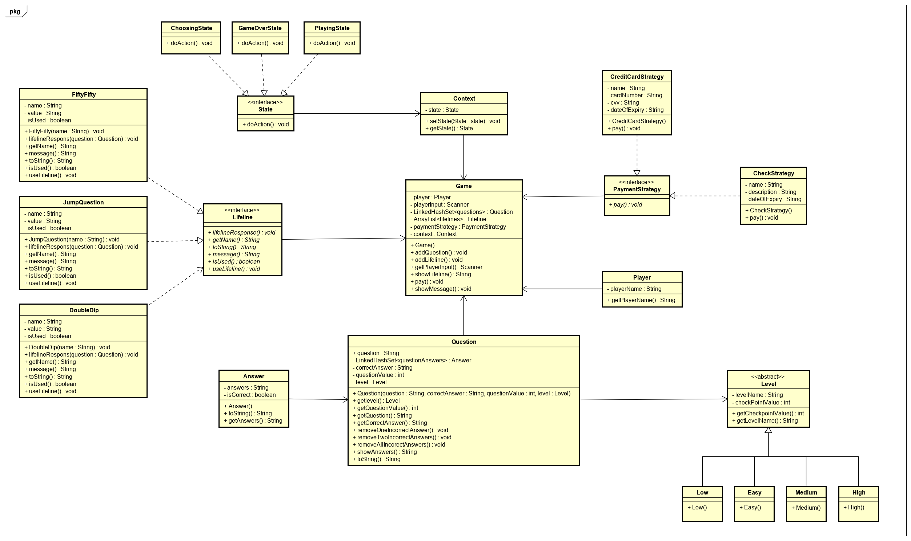

# Who-wants-to-be-a-millionaire-design-patterns
***
## Idea
Our idea for the design patterns course is to recreate the “Who wants to be a millionaire?” game in a digital environment in the purpose of highlighting the different design patterns that can be implemented. Therefore, a Java application will be created with the following specifications.

## Description
The player needs to correctly answer a series o multiple-choice questions in order to advance to the one-million-euro worth question. There are 15 different questions in total and each one is worth a specific amount of money. There are three different checkpoints in the game structure. The players accumulate money with each correct answer and if he answers incorrectly before he reaches any checkpoint than he loses everything accumulated. The player also gets three different Lifelines to assist them if they got stuck on a particular question and each lifeline can be used once.
- 50/50 – eliminates 2 incorrect answers, the remaining being one incorrect and the right one
- Double dip – eliminates 1 incorrect answer, the remaining being two incorrect and the right one
- Jump the question – in this case the player instantly gets the correct answer

#### Question 1 $100 
#### Question 2 $200 
#### Question 3 $300 
#### Question 4 $500 
#### Question 5 $1.000 – Checkpoint 

*If the players get this question wrong, they leave with nothing. If is answered correctly they have 1.000 guaranteed even if they answer incorrectly before the next checkpoint.*

#### Question 6 $2.000 
#### Question 7 $4.000 
#### Question 8 $8.000 
#### Question 9 $16.000 
#### Question 10 $32.000 – Checkpoint 

*If the players get this question wrong, they leave with 1.000. If is answered correctly they have 32.000 guaranteed even if they answer incorrectly before reaching the last question.*
        
#### Question 11 $64.000 
#### Question 12 $125.000 
#### Question 13 $250.000 
#### Question 14 $500.000 
#### Question 15 $1.000.000 BIG WIN!!

## Design Patterns used
Since design patterns are the typical solution to commonly occurring problems in software design, we will make use of the following patterns for a good and an efficient development.
#### Factory method 
– The class Lifeline will be an interface which is common to all objects that can be implemented by it.
#### Template 
– The game will be structured in levels starting with a lower’s difficulty level for the first question following with questions with a higher difficulty than the previous. There will be 4 different levels: Low, Easy, Medium, High. So basically, the Level class will be the “skeleton” and the Low, Easy, Medium, and High will override the methods without changing its structure.
#### Strategy 
– We implemented the strategy pattern for the payment system. If the player manages to secure one of the checkpoints and had money to receive, 2 strategies will be provided. One of them is to get the money via credit card and the second one is to receive a check. The player gets to choose one of them at the end of the game.
#### State
– To implement the state design pattern, we crated a State interface to define some actions and then concrete classes that represent various states and a context object whose behavior varies as its state object changes.

## UML

